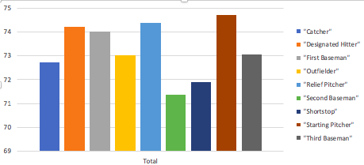

# Week 8 SGTA
# PRAC_01

The following are group exercises. For every group, nominate one person who will explain what you have done. The group exercises will be carried out as zoom breakouts and always the same students will be in the same group. Each time, nominate a different person so that all have the opportunite to practice their presentation skills.

## Activity 1 - Analyse Tables (10 minutes + 5 minutes discussion)

The following CSV file has been downloaded from https://people.sc.fsu.edu/~jburkardt/data/csv/csv.html and contains 1034 records with various information from baseball players.

* [mlb_players.csv](mlb_players.csv)

Conduct the following tasks:

1. Load the CSV data into a spreadsheet.
2. Format the data as a table.
3. Using the options provided by the table filters, identify the following information:
    - Name of the oldest player.
    - Name of the heaviest outfielder.
    - What are all the possible positions (catcher, outfielder, etc)?

Make sure that you document all the steps that you need to follow to identify the required information.

## Activity 2 - Reading tables in long format (5 minutes + 5 minutes discussion)

The following weather data contains information in a long format:

* [weather_data.csv](weather_data.csv)

Conduct the following tasks:

1. Load the CSV file into a spreadsheet.
2. Format the data as a table.
3. Using the options provided by the table filters, filter the data so that it shows only the precipitation data from Brookings.
4. Now, filter the data so that it shows only the maximum temperatures in all sites on 15/1/03.

Make sure that you document all the steps that you need to follow to identify the required information.

## Activity 3 - Long to Wide (10 minutes + 10 minutes discussion)

The following weather data is the same as in activity 2:

* [weather_data.csv](weather_data.csv)

With this table, build a pivot table that shows the following information in a wide format:

* The rows of the table show all dates, the columns show all sites, one column per site.
* The cells of the table indicate the *average* **maximum temperature** of the range of dates specified in the row for the site ID specified in the column.

Report the following:
1. What did you use in the "Rows" section of the pivot table?
2. What did you use in the "Columns" section?
3. What did you use in the "Values" section and how did you aggregate the values?
4. What did you use in the "Filters" section and what specific filter did you select?

# PRAC_02
The following are group exercises. For every group, nominate one person who will explain what you have done. The group exercises will be carried out as zoom breakouts and always the same students will be in the same group. Each time, nominate a different person so that all have the opportunite to practice their presentation skills.

## Activity 1 - Transform Data (10 minutes + 10 minutes discussion)

The following CSV file has been downloaded from https://people.sc.fsu.edu/~jburkardt/data/csv/csv.html and contains 1034 records with various information from baseball players.

* [mlb_players.csv](mlb_players.csv)

Conduct the following tasks:

1. Load the CSV data into a spreadsheet.
2. Format the data as a table.
3. Convert the height to centimetres and weight to kilograms.
4. The ages are expressed as years and fractions. Express the fractions as months and days using this simple convention:
    * Each year has 12 months.
    * Each month has 30 days.
5. Discuss how you could express the ages as years, months, and dates, more accurately.

## Activity 2 - Charting Pivot Tables (5 minutes + 5 minutes discussion)

Using the same data from activity 1, create a pivot chart that displays the average height of each player position. the resulting chart should look like this:

If you can figure out how, add a title and write sensible labels for the chart axes.

## Activity 3 - Long to Wide (10 minutes + 10 minutes discussion)

The following weather data is the same as in activity 2:

* [weather_data.csv](weather_data.csv)

With this table, build a pivot table so that it shows the following information in a wide format:

* The rows of the table show all dates, the columns show the precipitation, maximum temperature, and minimum temperature.

* The cells of the table indicate the *maximum* value of the type of measure indicated in the column within the range of dates specified in the row. **The data should show the values for Oceana only**.

Report the following:
1. What did you use in the "Rows" section of the pivot table?
2. What did you use in the "Columns" section?
3. What did you use in the "Values" section and how did you aggregate the values?
4. What did you use in the "Filters" section and what specific filter did you select?

