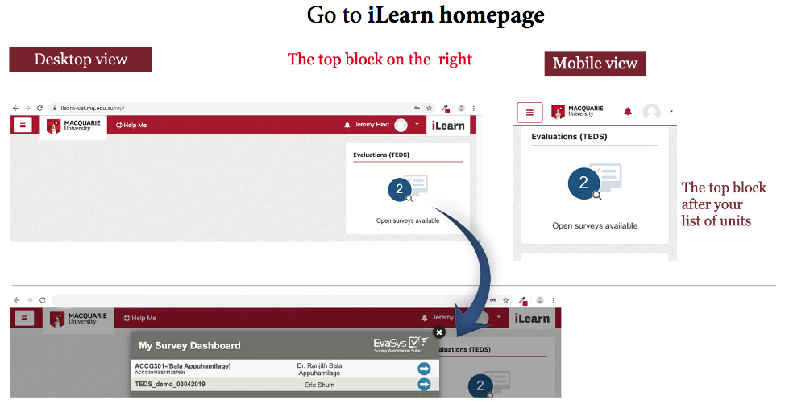

# Week 10 SGTA
# PRAC_01

## TEDS survey (15 minutes)

Please spend the first minutes of this session to complete the online survey of FOSE1025. You will find the survey on the right-hand side of the iLearn page when you login.

## Ethics case studies

The following are group exercises. For every group, nominate one person who will explain what you have done. The group exercises will be carried out as zoom breakouts and always the same students will be in the same group. Each time, nominate a different person so that all have the opportunity to practice their presentation skills.

### Imagined ethics case study (10 minutes + 10 minutes discussion)

Below is an imagined case. In your breakout room, read the case and answer the questions below.

> You need to determine the attitudes of Australians with respect to the use of online learning tools. Since you do not have much time you decide to gather a collection of tweet posts made available by Twitter and use it for your research. This collection is public, anybody can use it, but it is a small portion of all tweets posted by people worldwide. Twitter allows users to store the tweets collected for personal use but forbid users to distribute the tweets to other people.

1. If we store the tweets in our local computers, are there any issues related to privacy or security?
2. This scenario has issues regarding fairness. Discuss the nature of these issues.
3. Are there any issues related with disclosure?

### Real ethics case study (10 minutes + 10 minutes discussion)

The media has recently aired several possible ethic issues of the CovidSafe app that the Australian government has made available. In your breatkout room, outline the main issues reported by the media that are related to the ethical aspects of data that we are covering in this unit.

# PRAC_02

## Identify the version of your Excel and your operating system (5 minutes + 5 minutes discussion)

An important piece of information that you need to provide when you write a report for reproducibility is the version of your software and your operating system. This way other people can determine whether your instructions would apply to their setup. **You will need to provide this information in your assessed report for reproducibility, so make sure that you know how to find and report it.**

Write down the version of Excel installed in your computer and the details of your operating system. For example, my versions are:
* Excel: Microsoft Excel for Mac, Version 16.30, Office 365 Subscription
* Oparating system: macOS Sierra, Version 10.12.6

The following links can help you identify this information.

* [Version of Excel](https://support.office.com/en-us/article/about-office-what-version-of-office-am-i-using-932788b8-a3ce-44bf-bb09-e334518b8b19)
* Version of your Operating System 
    * [Windows](https://support.microsoft.com/en-au/help/13443/windows-which-version-am-i-running)
    * [Mac](https://support.apple.com/en-au/HT201260)
    * [Ubuntu](https://help.ubuntu.com/community/CheckingYourUbuntuVersion)

## Reproducibility

In the following exercises you will interact with the same system you will use for the reproducibility project. The reproducibility project has two steps and we will recreate them here. The main difference between the reproducibility project for assessment and the activities in this workshop is that **the reproducibility project is individual work, whereas the activities below are group work using breakout rooms.**

### Submit a Report (15 minutes + 5 minutes discussion)

Choose a task of your choice and write a set of instructions describing the task. For example, feel free to reuse your submission to the [Achiever hurdle task](https://ilearn.mq.edu.au/mod/turnitintooltwo/view.php?id=5602767). Please use your own work, do not copy and paste instructions from the Web, so that you have a chance to practice your skills on writing reports for reproducibility.

### Peer reviewing (15 minutes + 10 minutes discussion)

Use the interface to review at least two reports. In your review, focus on assessing the aspect of reproducibility. In particular, ask yourself this question: 
* With the information given in the report, would I be able to reproduce the task?

