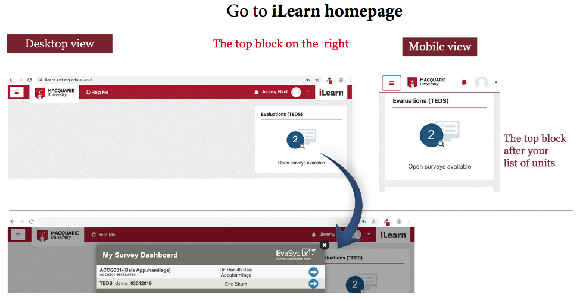

# Week 11 SGTA
# PRAC_01

The following (except the TEDS survey) are group exercises. For every group, nominate one person who will explain what you have done. The group exercises will be carried out as zoom breakouts and always the same students will be in the same group. Each time, nominate a different person so that all have the opportunity to practice their presentation skills.

## TEDS survey (15 minutes)

(This time hopefully the survey is available!)

Please spend the first minutes of this session to complete the online survey of FOSE1025. You will find the survey on the right-hand side of the iLearn page when you login.

## Upload files to MATLAB Drive (10 minutes + 10 minutes discussion)

The following links lead to MATLAB Online. Use them to start MATLAB Online:

* Information about MATLAB licenses for Macquarie University students: https://au.mathworks.com/academia/tah-portal/macquarie-university-916052.html
* Access MATLAB Online: https://matlab.mathworks.com/

In your breakout room, download all following CSV files from this folder (this is data you used in the SGTA of week 6):
* [MonthlySalesFiles](https://ilearn.mq.edu.au/mod/folder/view.php?id=5675219) 
and save them in a MATLAB Drive folder named `MonthlySalesFiles`.

To upload the CSV files into the folder, try the following two options and discuss the advantages and inconveniences of each:

1. Create the folder by interacting with MATLAB Online at https://matlab.mathworks.com.
    1. Create the folder `MonthlySalesFiles` by using the "New" option.
    2. Double-click on the folder to make it active.
    3. Upload the files to MATLAB Drive by using the "upload" option (or clicking and dragging them).
    If the files do not appear in your folder `MonthlySalesFiles`, click and drag them to the right folder.

2. Create the folder by interacting with MATLAB Drive https://drive.matlab.com/:
    1. Create a folder `MonthlySalesFiles` by using the "New Folder" option.
    2. Double-click on the folder to make it active.
    3. Upload the files by using the "Upload" option.
    If the files do not appear in your folder `MATLAB Workshop`, click and drag them to the right folder.

## Generate a Live Script (10 minutes + 10 minutes discussion)

In your breakout room, do the following tasks:

1. Import the CSV file that holds the February data from the previous exercise into MATLAB. The data must be stored in a variable called `sales_feb`. When importing the data, decide which columns store categorical data and change the column data types from whatever they are set by default to categorical.

2. When you import the data, use the option "Generate Live Script" and examine the resulting script. Do you understand it? Discuss with your peers the meaning or possible meaning of the script.

3. Modify the script so that it now imports the CSV file that holds the March data and saves it into a variable called `sales_mar`.

# PRAC_02

The following are group exercises. For every group, nominate one person who will explain what you have done. The group exercises will be carried out as zoom breakouts and always the same students will be in the same group. Each time, nominate a different person so that all have the opportunity to practice their presentation skills.

## Load tables in MATLAB (5 minutes + 5 minutes discussion)

If you have done PRAC_01 already, use the live script that you produced in PRAC_01 and import all CSV files of this folder: 
* [MonthlySalesFiles](https://ilearn.mq.edu.au/mod/folder/view.php?id=5675219) 
into three variables: `sales_jan`, `sales_feb`, `sales_mar`

If you have not done PRAC_01 yet, upload the following script to the MATLAB Drive:

* [LoadSales.mlx](LoadSales.mlx)

This live script will download the January data. Edit it so that it uses the correct path where your files are located. Again, edit it to load the February and March data.

## Process tables in MATLAB (10 minutes + 10 minutes discussion)

With the data that you have loaded into `sales_jan`, do the following operations:

1. Let's assume that the `Sales` column is in US dollars. Create a new column called `Sales_AUD` that has the equivalent value in Australian dollars. Use the current conversion rate (do a web search to find the current conversion rate).

2. Write MATLAB code that returns the first name of the person listed in the second row of the table.

3. Create a new column with name `FullName` that concatenates the first name and last name. For example, the full name of the first row of the January data is "Toh Karen.". (hint: use append https://au.mathworks.com/help/matlab/ref/append.html or strcat https://au.mathworks.com/help/matlab/ref/strcat.html).

4. Can you figure out how to reuse your code so that you can do the same with the February and the March data?

## Graphics in MATLAB (10 minutes + 10 minutes discussion)

Create a bar chart of all sales in the January data. To make the plot useful, remove the first row (since the sales reported in the first row will eclipse all other sales).

To create the bar chart you can try the following sequence:

1. Double-click on `sales_jan` so that you can explore the contents of the table.
2. Select the data that corresponds to rows 2 to the end in the `Sales` column.
3. Click on the variable, select "Plots" at the top menu, and select the bar chart.

When you do this, you will see the bar chart. Also, if you look in the command window, you will find the MATLAB instruction that can generate the plot directly. For documentation on the `bar` instruction, see: https://au.mathworks.com/help/matlab/ref/bar.html

Now, reuse the MATLAB code so that you can generate bar charts for the February and March data.

